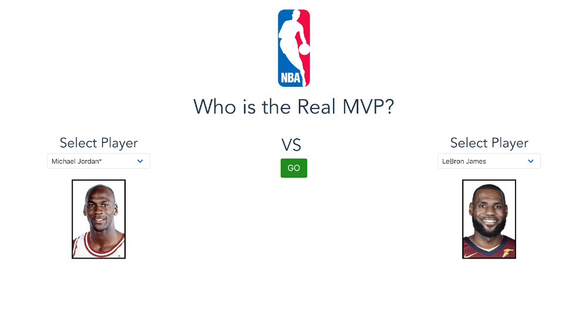

## Background
A few weeks into the fall semester, I participated in a 24 hour hackathon with 5 other members of the IS program. The challenge was hosted by the Wolff Company at BYU. The topic was pretty open ended, but we were asked to use large datasets in our deliverable. 

## Process
We decided to focus on sports. In brainstorming, we threw around the idea of comparing players from different eras of sports. Our goal — to find the GOAT of the NBA, throughout the years. 
For our large dataset, we scraped player stats from all seasons of the NBA from [Basketball Reference](https://www.basketball-reference.com). With this data, we used Tableau and Excel to note which features correlate the most to [win shares](https://www.basketball-reference.com/about/ws.html). While win shares are calculated with a fairly complex formula, the follow metrics had the highest correlation:
* Points per game
* Assists
* Rebounds
* Field goal percentage
* Free throw percentage
* Player Efficiency Rating ( [PER](https://www.basketball-reference.com/about/per.html) )

In summary, score more points, win more games.

We then set out to give a ranking for each of these metrics, on a scale of 100, to each player. This was inspired by NBA 2K games rating system. After setting a baseline of 100 for the all-time leader in each factor, we gave players a corresponding score relative to the baseline. Combining these scores, with the factors, gave us a combine ranking
Our top ten of all time, according to our algorithm:

| Ranking        | Player           | Rating  |
| ------------- |:-------------:| -----:|
| 1 | Wilt Chamberlain | 100 | 
| 2 | Michael Jordan | 95 | 
| 3 | LeBron James | 92 | 
| 4 | Bob Pettit | 92 |
| 5 | Kevin Durant | 91 | 
| 6 | Elgin Baylor | 91 |
| 7 | Larry Bird | 90 |
| 8 | Oscar Robertson | 90 | 
| 9 | Kareem Abdul-Jabbar | 90 |
| 10 | Anthony Davis | 90 |

Now is this a perfect ranking system? Probably not. The game played by Bob Pettit (1955-1965) and LeBron James are very different. But it's still fun to imagine the two going at it in a one-on-one game.

Using this data, we made a simple web application to show the top of the list and a feature to compare any two players. Ever wonder who is better between Allen Iverson and Steph Curry? Shaq and Joel Embiid? Scottie Pippen and Kawhi Leonard? (Steph, Shaq, and Kawhi according to our rankings...) The site lets you pick any two players and compare them. The metrics we tracked for each player were shown under their name and image.

## Results
We were able to do all of this in the 24-hour time limit. Our efforts paid off well, as we placed 2nd of around 15 other teams of BYU IS teams. It was fun to compare all these players and put some data behind these hypothetical questions. 
